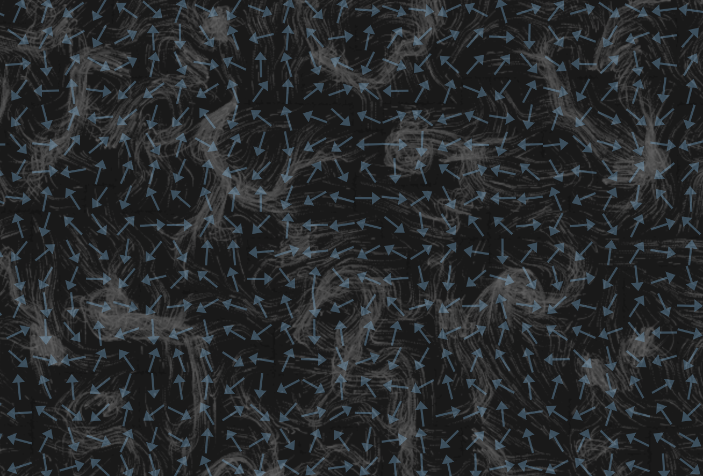

# Flow Field

Playing with a vector field in HTML5 canvas using vanilla Javascript. Vaguely inspired by how [this app](https://earth.nullschool.net/) renders winds.

The arrows layer is rendered using SVG elements.

